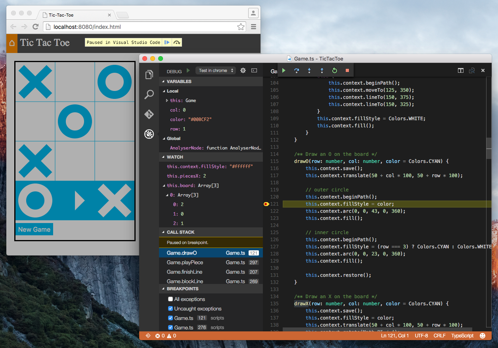

# Debugger for Chrome
A VS Code extension to debug your JavaScript code in the Chrome browser, or other targets that support the Chrome Debugging Protocol.



## Starting
The extension operates in two modes - it can launch an instance of Chrome navigated to your app, or it can attach to a running instance of Chrome. Just like when using the Node debugger, you configure these modes with a `.vscode/launch.json` file in the root directory of your project. You can create this file manually, or Code will create one for you if you try to run your project, and it doesn't exist yet.

To use this extension, you must first open the folder containing the project you want to work on.

### Launch
An example `launch.json` config. You must specify either `file` or `url` to launch Chrome against a local file or a url.
```
{
    "version": "0.1.0",
    "configurations": [
        {
            "name": "Launch index.html",
            "type": "chrome",
            "request": "launch",
            "file": "index.html"
          },
          {
            "name": "Launch localhost with sourcemaps",
            "type": "chrome",
            "request": "launch",
            "url": "http://localhost/mypage.html",
            "sourceMaps": true
          }
    ]
}
```

If you want to use Chrome from a different directory, you can also set the "runtimeExecutable" field with a path to the Chrome app.

### Attach
You must launch Chrome with remote debugging enabled in order for the extension to attach to it.

__Windows__
* Right click the Chrome shortcut, and select properties
* In the "target" field, append `--remote-debugging-port=9222`
* Or in a command prompt, execute `<path to chrome>/chrome.exe --remote-debugging-port=9222`

__OS X__
* In a terminal, execute `/Applications/Google\ Chrome.app/Contents/MacOS/Google\ Chrome --remote-debugging-port=9222`

Launch Chrome and navigate to your page.

An example `launch.json` config.
```
{
    "version": "0.1.0",
    "configurations": [
        {
            "name": "Attach",
            "type": "chrome",
            "request": "attach",
            "port": 9222
        }
    ]
}
```

### Other targets
You can also theoretically attach to other targets that support the same Chrome remote debugging protocol, such as Electron or Cordova. These aren't officially supported, but should work with basically the same steps. You can use a launch config by setting `"runtimeExecutable"` to a program or script to launch, or an attach config to attach to a process that's already running. If Code can't find the target, you can always verify that it is actually available by navigating to `http://localhost:<port>/json` in a browser. If you get a response with a bunch of JSON, and can find your target page in that JSON, then the target should be available to this extension.

### Other launch config fields
* diagnosticLogging: When true, the adapter logs its own diagnostic info to the console
* runtimeExecutable: Workspace relative or absolute path to the runtime executable to be used. If not specified, Chrome will be used from the default install location
* runtimeArgs: Optional arguments passed to the runtime executable

## Usage
When your launch config is set up, you can debug your project! Pick a launch config from the dropdown on the Debug pane in Code. Press the play button or F5 to start.

**Things that should work**
* Setting breakpoints, including in source files when source maps are enabled
* Stepping, including with the buttons on the Chrome page
* The Locals pane
* Debugging eval scripts, script tags, and scripts that are added dynamically
* Watches
* The debug console
* Most console APIs

**Unsupported scenarios**
* Debugging webworkers

## Troubleshooting
General things to try if you're having issues:
* Close other running instances of Chrome
* Ensure nothing else is using port 9222, or specify a different port in your launch config
* Check the console for warnings that this extension prints in some cases when it can't attach
* Ensure the code in Chrome matches the code in Code. Chrome may cache an old version.
* File a bug in this extension's [GitHub repo](https://github.com/Microsoft/vscode-webkit-debug). Set the "diagnosticLogging" field in your launch config and attach the logs when filing a bug.
